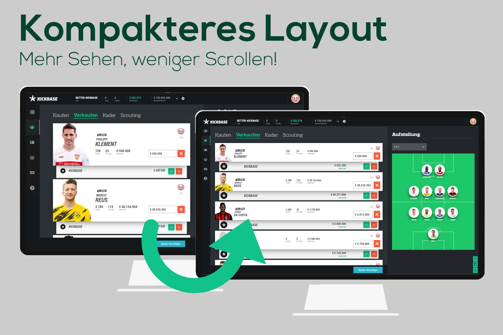
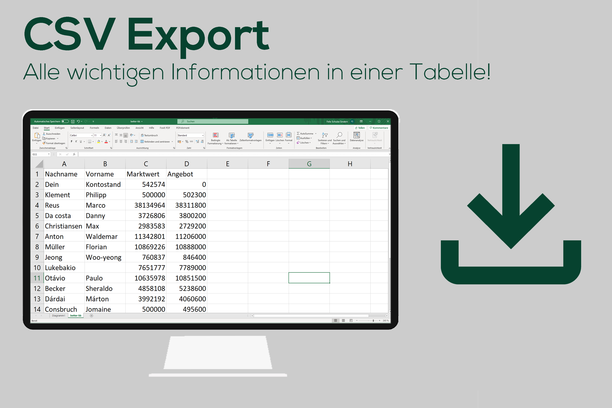
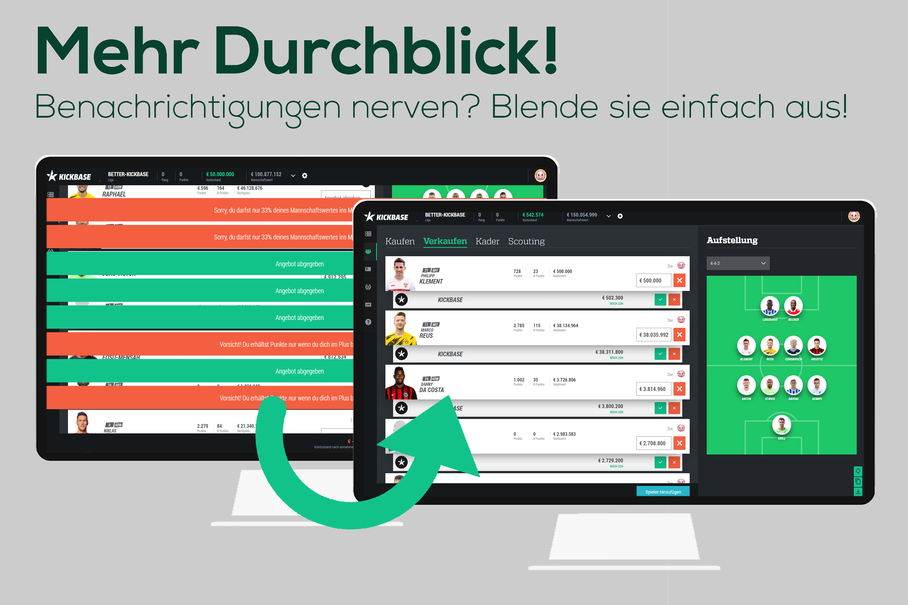

# better-kickbase
#### Manage dein Team effizienter mit der Browser Erweiterung better-kickbase!

## Funktionen

|   |   |  |
| - | - | - | 
| Durch das kompaktere Layout siehst du mehr Informationen auf einen Blick! | Lade eine Liste deiner Spieler, deren Marktwerten und vorliegenden Angeboten als `.csv`-Datei herunter. | Mit `better-kickbase` kannst du Benachrichtigungen ausblenden. |

## Installation
|Firefox|Chrome| Edge    |Brave   |Opera   |Safari  |
|-|-|-|-|-|-|
|||||||
|[Mozilla Add-ons](https://addons.mozilla.org/addon/better-kickbase/)|In Kürze!|In Kürze!|In Kürze!|In Kürze!|Nicht unterstützt ❌|

In Kürze wird die Erweiterung im Chrome Web Store verfügbar sein, bis dahin kann die Erweiterung für Chromium-basierte Browser ausschließlich im Entwicklermodus installiert werden.

### Installation im Entwicklermodus
1. Zur Erweiterungsseite ([chrome://extensions](chrome://extensions), [brave://extensions](brave://extensions), etc.) navigieren und den Entwicklermodus aktivieren
2. `better-kb.zip` [hier](https://github.com/FelixSchuSi/better-kickbase/releases) aus dem letzten Release herunterladen
3. Per drag-and-drop die Zip Datei als Erweiterung installieren
