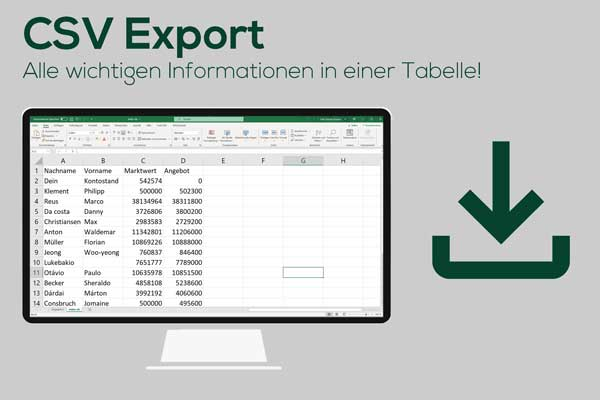

### ⚠️play.kickbase.com wurde offline genommen, daher kann die Erweiterung nicht mehr genutzt werden⚠️

# better-kickbase

#### Manage dein Team effizienter mit der Browser Erweiterung better-kickbase!

## Funktionen

<table>
  <tr>
    <td>
       
    </td>
    <td>
       
    </td>
    
  </tr>
  <tr>
    <td>
       
    </td>
    <td>
       
    </td>
  </tr>
</table>

## Installation

| Firefox                                                              | Chrome                                                                                                         | Edge                                                                                                           | Brave                                                                                                          | Opera                                                                                                          | Safari                                      |
| -------------------------------------------------------------------- | -------------------------------------------------------------------------------------------------------------- | -------------------------------------------------------------------------------------------------------------- | -------------------------------------------------------------------------------------------------------------- | -------------------------------------------------------------------------------------------------------------- | ------------------------------------------- |
|                         |                                                                     |                                                                         |                                                                       |                                                                       |  |
| [Mozilla Add-ons](https://addons.mozilla.org/addon/better-kickbase/) | [Chrome Web Store](https://chrome.google.com/webstore/detail/better-kickbase/jdkehjokegcepbmbmcbaojnpkmnolgkg) | [Chrome Web Store](https://chrome.google.com/webstore/detail/better-kickbase/jdkehjokegcepbmbmcbaojnpkmnolgkg) | [Chrome Web Store](https://chrome.google.com/webstore/detail/better-kickbase/jdkehjokegcepbmbmcbaojnpkmnolgkg) | [Chrome Web Store](https://chrome.google.com/webstore/detail/better-kickbase/jdkehjokegcepbmbmcbaojnpkmnolgkg) | Nicht unterstützt ❌                        |

## Manuelle Installation

Gelegentlich wird die neuste Version der Erweiterung in den Extension Stores veröffentlicht. Wenn du auf die neusten Features zurückgreifen möchtest, kannst du die Erweiterung manuell im Entwicklermodus installieren.

1. Zur Erweiterungsseite ([chrome://extensions](chrome://extensions), [brave://extensions](brave://extensions), etc.) navigieren und den Entwicklermodus aktivieren
2. `better-kb.zip` [hier](https://github.com/FelixSchuSi/better-kickbase/releases) aus dem letzten Release herunterladen
3. Per drag-and-drop die Zip Datei in das Fenster der Erweiterungsseite ziehen und damit die Erweiterung installieren
